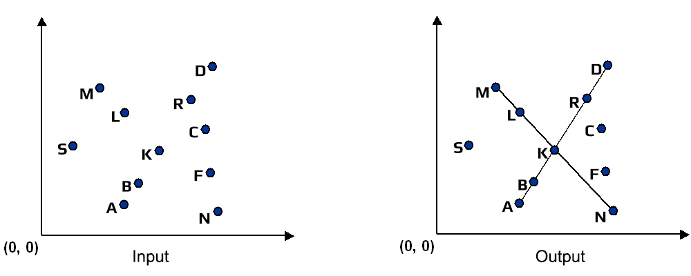

<h2>Algorithms for recognizing line patterns in a given set of points.</h2>

Authors: Gleb

Reviewers: Slava [X] Ivanna [ ] Sergey [ ]

<h2>Preamble</h2>

This document describes a quick algorithm for searching all collinear points. The problem is described in the following [document](http://coursera.cs.princeton.edu/algs4/assignments/collinear.html).

<h2>Problem</h2>

From the set of given dots, on a 2D plane, find all maximal lines, that contain at least 4 dots...

<h2>Solution</h2>

The algorithm, on a high level, can be described as following:

_Input:_ Set of dots

    [S M A L B K R C F D N]

_Output:_ Set of line segments

    [M N] (or [N M]), [A D] (or [D A])

_Steps:_

1.  Sort the input set of dots by natural order ([link](https://stackoverflow.com/questions/5167928/what-is-natural-ordering-when-we-talk-about-sorting))

> _s1_ = set([N A B F K S C L R M D])

2.  Sort the new set (s2) according to the angel that each dot create with the head of the original set (s1)

  

<table>
  <tr>
   <td>
<em>Point</em>
   </td>
   <td>N
   </td>
   <td>A
   </td>
   <td>B
   </td>
   <td>F
   </td>
   <td>K
   </td>
   <td>S
   </td>
   <td>C
   </td>
   <td>L
   </td>
   <td>R
   </td>
   <td>M
   </td>
   <td>D
   </td>
  </tr>
  <tr>
   <td><em>Slope</em>
   </td>
   <td> -Inf
   </td>
   <td>-0.07
   </td>
   <td>-0.16
   </td>
   <td>-0.75
   </td>
   <td>-0.5
   </td>
   <td>-0.3
   </td>
   <td>-1
   </td>
   <td>-0.5
   </td>
   <td>-1
   </td>
   <td>-0.5
   </td>
   <td>-5
   </td>
  </tr>
</table>

> _s2_ = set([N D C R F K L M S B A])

3.  For the sorted set, find all sub-sets with 3 (or more) dots that have the same slope (and _smaller dot in subset_ bigger comparing to the original set's head (N from _s1_))

<table>
  <tr>
   <td>
<em>Point</em>
   </td>
   <td>N
   </td>
   <td>D
   </td>
   <td>C
   </td>
   <td>R
   </td>
   <td>F
   </td>
   <td>K
   </td>
   <td>L
   </td>
   <td><em>M</em>
   </td>
   <td>S
   </td>
   <td>B
   </td>
   <td>A
   </td>
  </tr>
  <tr>
   <td><em>Slope</em>
   </td>
   <td>-Inf
   </td>
   <td>-5
   </td>
   <td>-1
   </td>
   <td>-1
   </td>
   <td>-0.75
   </td>
   <td>-0.5
   </td>
   <td>-0.5
   </td>
   <td>-0.5
   </td>
   <td>-0.3
   </td>
   <td>-0.16
   </td>
   <td>-0.07
   </td>
  </tr>
</table>

> _s2_subset1_ = set([K L M])

4.  For each subset fond on the step 4 return line segment with the original set's head (N) and the last dot from each subset:

> _liensegment1_ = [N, M]

5.  Change head to the next dot and repeat from step 1 if there are elements left

<h2>Alternatives</h2>

Brute force solution, that has the order of growth of the running time N^4 in the worst case.
